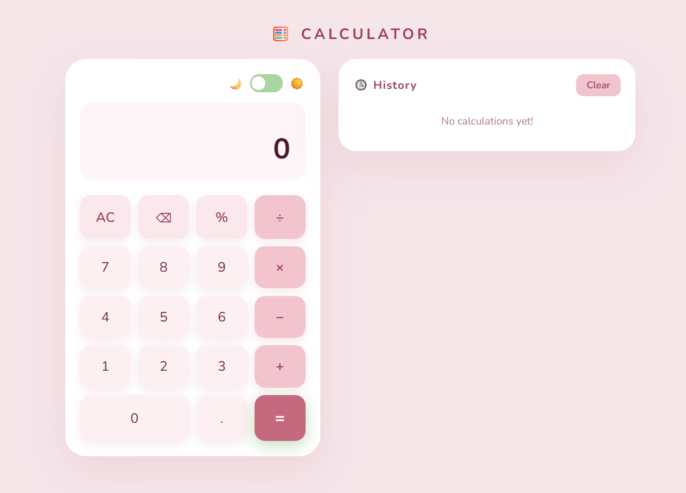
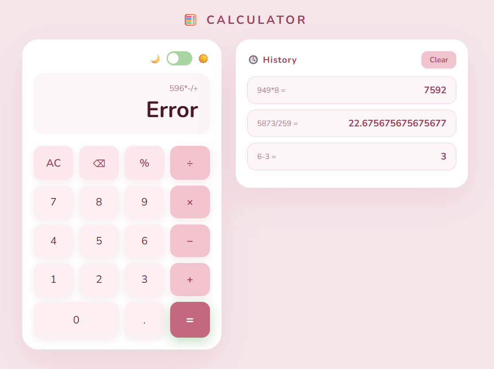
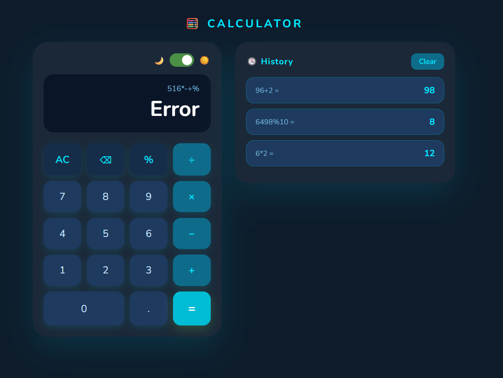

SCT_WD_2 - Calculator Web Application

A fully functional calculator web application with calculation history and dark/light mode toggle, built during my Web Development Internship at SkillCraft Technology.

# Task Description
Build a fully functional calculator web application that:
- Handles basic arithmetic operations
- Implements DOM manipulation and event handling
- Supports keyboard input
- Includes error handling
- Tracks and displays calculation history

 # Technologies Used
- HTML5
- CSS3
- JavaScript 

 # Features
- Basic arithmetic operations (addition, subtraction, multiplication, division)
- Calculation history saved and displayed
- Dark / Light mode toggle
- Keyboard input support
- Error handling for invalid expressions
- Fully responsive design

# Project Structure
SCT_WD_2/
├── index.html
├── style.css
├── script.js
└── README.md

# Live Demo
[Click here to view](#) (https://varinda-aggarwal.github.io/SCT_WD_2/)

# Screenshots

# Author
Varinda Aggarwal 
Web Development Intern @SkillCraft Technology

# Connect
- GitHub: [@varinda-Aggarwal](https://github.com/varinda-Aggarwal)
- LinkedIn: [Varinda Aggarwal](https://www.linkedin.com/in/varinda-aggarwal-537101308)
